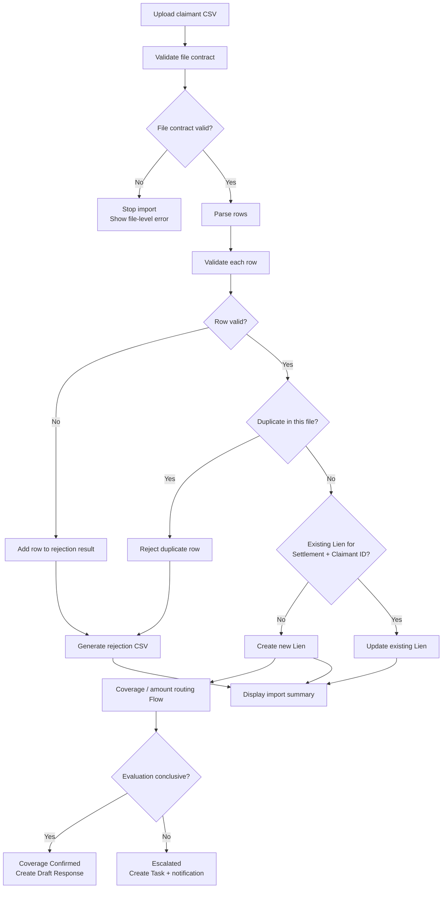

# Claimant Intake Validation and Rejection Handling — Demo Specification

## 1. Purpose

Add an explicit data-quality gate between claimant-file receipt and Lien creation.

The current importer parses rows and creates Liens, but it does not demonstrate the PDF’s requirement to validate claimant data against an agreed data-quality contract. It also conflates two different operational outcomes:

- **Intake rejection:** the administrator’s row is incomplete, invalid, duplicated, or incompatible with the selected settlement.
- **Claim-evaluation escalation:** the row passed intake and became a valid Lien, but coverage or recoverable amount could not be confirmed.

The enhanced import must make this distinction visible and auditable.

## 2. Demo outcome

When the presenter uploads and processes the claimant CSV, Salesforce displays:

- Rows received
- Liens created
- Existing Liens updated
- Rows rejected during intake validation
- Valid Liens processing automatically
- Valid Liens escalated for coverage review

If any rows are rejected, Salesforce generates a rejection CSV and attaches it to the Settlement.

The presenter can then show:

1. The import summary.
2. The rejection file and specific data-quality reasons.
3. The Lien Escalation Queue, containing valid Liens requiring coverage research.

## 3. Process model



## 4. Scope

### Included

- Exact CSV header validation.
- Required-field validation.
- Allowed-value validation.
- Recoverable-amount parsing and range validation.
- Health Plan Account existence validation.
- Settlement participation validation using `Settlement_Health_Plan__c`.
- Duplicate Claimant ID detection within the uploaded file.
- Existing Lien detection by Settlement + Claimant ID.
- Create-new versus update-existing behavior.
- Row-level rejection reasons.
- Rejection CSV attached to the Settlement.
- Import summary returned to the Screen Flow.
- Backward compatibility for the Static Resource import action.
- Apex tests for valid, rejected, duplicate, create, and update paths.

### Excluded

- Production-scale 100,000-row processing.
- Bulk API 2.0.
- Asynchronous job tracking.
- SFTP delivery of acknowledgment/error files.
- Cross-file checksum/idempotency.
- Fuzzy claimant matching.
- Master patient/member identity resolution.
- Address, date-of-birth, SSN, or healthcare-claim validation.
- Configurable data contracts stored as metadata.
- Persistent import-job or row-error objects.
- Full transaction rollback and recovery across batch chunks.

These are later-phase production concerns. The demo proves the validation pattern and operational distinction.

## 5. Input contract

### Supported format

- CSV
- UTF-8
- One header row
- One or more data rows
- Comma delimiter
- Quoted fields supported
- Maximum demo file size: 1 MB
- Maximum demo row count: 2,000

The size and row limits are demo guardrails, not production limits.

### Required header

The file must contain this exact ordered header:

```csv
Claimant_Name,Claimant_ID,Health_Plan,Injury_Category,Coverage_Result,Recoverable_Amount
```

Header comparison:

- Trim leading and trailing whitespace.
- Remove a UTF-8 BOM from the first header if present.
- Treat header spelling as case-sensitive for the demo.
- Reject missing, additional, reordered, or misspelled columns.

### File-level errors

Stop the import without creating or updating any Lien when:

| Code | Condition | Message |
|---|---|---|
| `EMPTY_FILE` | File body is empty | `The uploaded claimant file is empty.` |
| `HEADER_MISMATCH` | Header does not exactly match | `The claimant file columns do not match the expected data contract.` |
| `NO_DATA_ROWS` | Header exists but no data rows | `The claimant file contains no claimant rows.` |
| `FILE_TOO_LARGE` | File exceeds demo limit | `The claimant file exceeds the demo size limit.` |
| `TOO_MANY_ROWS` | File exceeds demo row limit | `The claimant file exceeds the demo row limit.` |

File-level errors appear directly in the Flow. They do not produce a rejection CSV because no valid row-processing run occurred.

## 6. Row validation rules

Evaluate every nonblank data row. A rejected row must not create or update a Lien.

### Validation order

Apply rules in this order so the rejection reason is deterministic:

| Priority | Code | Rule | User-facing reason |
|---:|---|---|---|
| 1 | `COLUMN_COUNT` | Row must contain exactly six columns | `Row does not contain the expected six columns.` |
| 2 | `MISSING_CLAIMANT_NAME` | Claimant Name is required | `Claimant Name is required.` |
| 3 | `MISSING_CLAIMANT_ID` | Claimant ID is required | `Claimant ID is required.` |
| 4 | `CLAIMANT_ID_TOO_LONG` | Claimant ID must fit `Lien__c.Claimant_ID__c` | `Claimant ID exceeds the supported length.` |
| 5 | `MISSING_HEALTH_PLAN` | Health Plan is required | `Health Plan is required.` |
| 6 | `UNKNOWN_HEALTH_PLAN` | Exact Account-name match must exist | `Health Plan does not match an Account in Salesforce.` |
| 7 | `NONPARTICIPATING_HEALTH_PLAN` | Plan must be linked to Settlement | `Health Plan is not configured for this settlement.` |
| 8 | `MISSING_INJURY_CATEGORY` | Injury Category is required | `Injury Category is required.` |
| 9 | `INVALID_COVERAGE_RESULT` | Allowed values only | `Coverage Result must be Confirmed or Unable to Confirm.` |
| 10 | `MISSING_RECOVERABLE_AMOUNT` | Required when coverage is Confirmed | `Recoverable Amount is required when coverage is Confirmed.` |
| 11 | `INVALID_RECOVERABLE_AMOUNT` | Value must parse as Decimal | `Recoverable Amount must be numeric.` |
| 12 | `NEGATIVE_RECOVERABLE_AMOUNT` | Amount cannot be negative | `Recoverable Amount cannot be negative.` |
| 13 | `NONPOSITIVE_CONFIRMED_AMOUNT` | Confirmed coverage requires amount greater than zero | `Confirmed coverage requires a Recoverable Amount greater than zero.` |
| 14 | `DUPLICATE_IN_FILE` | Claimant ID may appear once in a file | `Claimant ID appears more than once in this file.` |

### Allowed coverage results

```text
Confirmed
Unable to Confirm
```

For `Unable to Confirm`, a blank Recoverable Amount is allowed because the valid Lien will enter the coverage-escalation path.

### Whitespace

Trim all fields before validation and assignment.

### Case handling

For the demo:

- Claimant ID duplicate comparison is case-insensitive.
- Health Plan Account-name matching is case-insensitive after trimming.
- Coverage Result should be normalized to the exact Salesforce picklist value.

## 7. Duplicate behavior

### Duplicate within the same file

The first otherwise-valid occurrence of a Claimant ID is processed. Each later occurrence is rejected with:

```text
DUPLICATE_IN_FILE
```

This avoids ambiguity about which row should win.

### Existing Lien

An existing Lien is identified using:

```text
Settlement__c + normalized Claimant_ID__c
```

If exactly one existing Lien is found:

- Update claimant name.
- Update Health Plan.
- Update Health Plan Text.
- Update injury category.
- Update coverage result.
- Update recoverable amount.
- Preserve original Intake Date.
- Recalculate Response Deadline only if the intended business rule is explicitly selected for the demo; otherwise preserve it.

If more than one existing Lien is found for the same composite key, reject the incoming row:

| Code | Reason |
|---|---|
| `AMBIGUOUS_EXISTING_LIEN` | `More than one existing Lien matches this Settlement and Claimant ID.` |

### Routing behavior for updates

The current routing Flow fires only when a Lien is created. Therefore, the minimum safe demo behavior is:

- Create path: existing routing Flow runs normally.
- Update path: update the Lien data, count it as Updated, and preserve its existing Stage and related Response.

Do not claim that an updated row automatically re-evaluates an existing Lien unless the Flow is deliberately extended and tested.

Optional enhancement:

- Extend the routing Flow to run when `Coverage_Result__c` or `Recoverable_Amount__c` changes.
- Add safeguards preventing duplicate Response and Task creation.

This enhancement is outside the minimum validation build.

## 8. Health plan participation validation

The importer must preload:

1. Accounts matching Health Plan names in the file.
2. `Settlement_Health_Plan__c` rows for the selected Settlement.

A row passes the plan checks only if:

- A matching Account exists.
- That Account is linked to the selected Settlement through `Settlement_Health_Plan__c`.

Do not validate only against Account existence. The PDF specifically identifies participating health plans as Settlement configuration.

## 9. Service result contract

Replace the current count-only internal contract with a typed result.

### Apex type

```apex
public class ClaimantImportResult {
    public Integer rowsReceived = 0;
    public Integer createdCount = 0;
    public Integer updatedCount = 0;
    public Integer rejectedCount = 0;
    public Integer automatedCount = 0;
    public Integer escalatedCount = 0;
    public String rejectionFilename;
    public Id rejectionContentDocumentId;
    public List<ClaimantRowError> rowErrors = new List<ClaimantRowError>();
}
```

### Row error type

```apex
public class ClaimantRowError {
    public Integer rowNumber;
    public String claimantId;
    public String claimantName;
    public String rejectionCode;
    public String rejectionReason;
    public String originalRow;
}
```

Do not expose `originalRow` through the UI. It is only used to construct the rejection file and must be reviewed before production use because source rows may contain sensitive information.

### Backward compatibility

`ClaimantImportController.importClaimants` currently returns:

```apex
Map<String, Integer>
```

Two acceptable approaches:

#### Preferred

Change both the controller and LWC to return/use a typed Aura-enabled result.

#### Lowest-risk

Keep `ClaimantImportController` as a compatibility wrapper and map:

- `total` → `rowsReceived`
- `automated` → `automatedCount`
- `escalated` → `escalatedCount`
- Add `created`, `updated`, and `rejected`

The uploaded-file Flow should use the full typed invocable result.

## 10. Processing design

### Class

Enhance:

```text
ClaimantImportService.cls
```

### Recommended public method

```apex
public static ClaimantImportResult importFromCsv(
    Id settlementId,
    Blob csvBody
)
```

### Processing sequence

1. Validate Settlement ID and access.
2. Validate file size.
3. Normalize line endings.
4. Validate the header.
5. Parse all nonblank rows.
6. Validate column count and basic fields.
7. Collect Health Plan names and Claimant IDs.
8. Query Accounts in one SOQL operation.
9. Query Settlement Health Plans in one SOQL operation.
10. Query existing Liens for the Settlement and Claimant IDs in one SOQL operation.
11. Apply remaining row validation.
12. Separate rows into:
    - Creates
    - Updates
    - Rejections
13. Insert new Liens.
14. Update existing Liens.
15. Query created Liens after the routing Flow finishes.
16. Count Coverage Confirmed and Escalated outcomes for newly created Liens.
17. Generate and attach the rejection CSV when errors exist.
18. Return the typed result.

No SOQL or DML may occur inside a row-processing loop.

## 11. DML behavior

Use `Database.insert(records, false)` and `Database.update(records, false)` so one unexpected DML error does not discard every valid row.

Convert any failed `SaveResult` into a rejection:

| Code | Reason |
|---|---|
| `LIEN_CREATE_FAILED` | Sanitized first DML error |
| `LIEN_UPDATE_FAILED` | Sanitized first DML error |

Do not expose record IDs, stack traces, validation formulas, or internal exception details in the presenter-facing error.

The returned counts must reflect committed results, not merely attempted DML.

## 12. Rejection CSV

### Filename

```text
Claimant_Import_Rejections_<YYYYMMDD-HHmmss>.csv
```

### Columns

Use this exact order:

```csv
Row_Number,Claimant_ID,Claimant_Name,Rejection_Code,Rejection_Reason
```

Do not include the entire original source row in the rejection file for the demo.

### Attachment

Create a Salesforce File using:

- `ContentVersion.Title` = filename without `.csv`
- `ContentVersion.PathOnClient` = filename
- `ContentVersion.VersionData` = UTF-8 CSV body

Link it to the selected Settlement using `ContentDocumentLink`.

Use the same visibility pattern as the existing response-file generator unless security testing identifies a reason to restrict it.

### CSV escaping

- Quote every text value.
- Double embedded quotes.
- Preserve commas inside quoted values.
- Use a locale-independent row number.

## 13. Screen Flow changes

Update the completed uploaded-file Flow’s result screen.

### Success with no rejections

Display:

```text
Import complete

15 rows received
13 liens created
2 liens updated
0 rows rejected
11 processing automatically
2 routed for coverage review
```

### Success with rejections

Display:

```text
Import complete with data-quality issues

15 rows received
10 liens created
1 lien updated
4 rows rejected
8 processing automatically
2 routed for coverage review

Rejection file:
Claimant_Import_Rejections_20260728-103500.csv
```

Use a warning visual treatment when `rejectedCount > 0`; do not present partial rejection as a generic green success.

### File-level failure

Display the returned file-contract error and do not navigate away automatically.

## 14. Static Resource action changes

The existing `Import Claimants` LWC must use the same enhanced service.

Update its toast:

```text
15 rows processed — 10 created, 1 updated, 4 rejected;
8 processing automatically and 2 routed for coverage review.
```

If rejections exist, use `warning`, not `success`.

The Static Resource remains a fallback, but both entry points must exercise identical validation logic.

## 15. Demo input file

Create a separate demo-validation CSV or update the uploaded demo file to contain:

| Row type | Count | Expected outcome |
|---|---:|---|
| Valid, Confirmed, positive amount | 8 | Create Lien → Coverage Confirmed |
| Valid, Unable to Confirm, blank amount | 2 | Create Lien → Escalated |
| Existing Claimant ID | 1 | Update existing Lien |
| Unknown or nonparticipating plan | 1 | Reject |
| Missing Claimant ID | 1 | Reject |
| Nonnumeric amount | 1 | Reject |
| Duplicate Claimant ID within file | 1 | Reject later occurrence |
| **Total** | **15** | 10 created, 1 updated, 4 rejected |

Adjust the exact counts if a clean existing record cannot be staged reliably. The result screen and talk track must match the final fixture.

## 16. Recommended sample rejection rows

```csv
Claimant_Name,Claimant_ID,Health_Plan,Injury_Category,Coverage_Result,Recoverable_Amount
Alex Morgan,CLM-BAD-001,Unknown Health Plan,Hip Implant,Confirmed,2500.00
Taylor Green,,Health Plan A,Hip Implant,Confirmed,1800.00
Casey Lee,CLM-BAD-003,Health Plan B,Hip Implant,Confirmed,not-a-number
Jordan Duplicate,CLM-00001,Health Plan A,Hip Implant,Confirmed,4250.00
```

The duplicate row must appear after the first occurrence of its Claimant ID.

## 17. Apex tests

Enhance or create:

```text
ClaimantImportServiceTest.cls
ClaimantFileImportInvocableTest.cls
```

### Required cases

1. Exact valid header succeeds.
2. Header mismatch rejects the entire file without DML.
3. Empty file is rejected.
4. Header-only file is rejected.
5. Valid Confirmed row creates a Coverage Confirmed Lien and Draft Response.
6. Valid Unable to Confirm row creates an Escalated Lien and Task.
7. Missing Claimant ID rejects the row.
8. Unknown Health Plan rejects the row.
9. Existing but nonparticipating Health Plan rejects the row.
10. Nonnumeric amount rejects the row without failing the import.
11. Negative amount rejects the row.
12. Confirmed with blank/zero amount rejects the row.
13. Duplicate Claimant ID in one file rejects the later row.
14. Existing Settlement + Claimant ID updates instead of inserting.
15. Mixed file commits valid rows and rejects invalid rows.
16. Rejection CSV is created and linked to the Settlement.
17. Rejection CSV contains row number, code, and escaped reason.
18. No rejection file is created when all rows are valid.
19. Returned counts match committed and routed records.
20. Uploaded-file invocable returns all result fields.

## 18. Acceptance criteria

- [ ] Import validates the exact expected header.
- [ ] Invalid file contract creates no Liens.
- [ ] Every nonblank row is either created, updated, or rejected.
- [ ] No malformed row is silently skipped.
- [ ] Nonnumeric amounts do not crash the entire import.
- [ ] Health Plan must exist and participate in the Settlement.
- [ ] Duplicate Claimant IDs in one file are detected.
- [ ] Existing Settlement + Claimant ID updates instead of duplicating.
- [ ] Rejected rows do not create Liens.
- [ ] Coverage failures create valid Liens and enter the Escalation Queue.
- [ ] Rejection reasons are deterministic and business-readable.
- [ ] Rejection CSV is attached to the Settlement when needed.
- [ ] Result screen separately shows created, updated, rejected, automated, and escalated counts.
- [ ] Static Resource and uploaded-file paths share the same validation service.
- [ ] Valid-row processing is bulkified.
- [ ] Required tests pass.
- [ ] Demo fixture produces stable counts after reset.

## 19. Demo click path

1. Open the demo Settlement.
2. Show its participating Health Plans.
3. Select **Import Claimant File**.
4. Upload the validation demo CSV.
5. Select **Validate and Process**.
6. Pause on the result screen.
7. Point to:
   - Rows received
   - Created
   - Updated
   - Rejected
   - Automatically processing
   - Coverage escalations
8. Open or point to the rejection CSV on the Settlement.
9. Explain one unknown-plan rejection and one malformed-amount rejection.
10. Open the Lien related list and show valid created Liens.
11. Open the Escalation Queue and show valid Liens requiring coverage research.

## 20. Talk track

Before processing:

> “Receiving the file is not the same as accepting its contents. Before a claimant can become a lien, every row has to meet the data contract for this settlement.”

On the result screen:

> “Fifteen rows arrived. Ten created new liens and one updated the existing claimant rather than creating a duplicate. Four did not meet the intake contract, so they were rejected with explicit reasons.”

On the rejection file:

> “These rows never became incomplete recovery records. One references a plan that is not configured for this settlement, another is missing its claimant identifier, and another contains an invalid amount. Salesforce preserved those reasons in the rejection file that would be returned to the administrator through SFTP.”

On the Escalation Queue:

> “These are different from rejected rows. They passed intake and became valid liens, but coverage could not be confirmed. That is business work for a person, with ownership and a due date, rather than a request to correct the inbound file.”

Scope disclosure:

> “The prototype executes the validation and produces the real rejection artifact. Delivery back to the administrator is simulated; the Phase 1 SFTP adapter would transport this same file.”

## 21. Reset procedure

Before rehearsal:

1. Delete demo-created Liens using the known demo Claimant ID prefix.
2. Restore the single record used for the update case.
3. Remove Tasks created for the demo escalated Liens.
4. Remove or ignore old rejection files.
5. Confirm participating Health Plan junction records exist.
6. Upload a fresh copy of the validation demo CSV.

Never delete records using a broad Settlement-only filter when the volume and live demo settlements coexist.

## 22. Estimated effort

| Work item | Estimate |
|---|---:|
| Typed result and row-error types | 20–30 min |
| File/header validation | 25–40 min |
| Row validation and plan participation | 45–60 min |
| Duplicate/create/update handling | 35–50 min |
| Partial DML and routed counts | 30–45 min |
| Rejection CSV generation | 25–40 min |
| Flow/LWC result changes | 25–40 min |
| Tests and demo fixture | 60–90 min |
| Rehearsal and reset verification | 30–45 min |
| **Total** | **4.5–7 hours** |

### One-day cut line

If the schedule is constrained, implement this minimum:

1. Header validation.
2. Required fields.
3. Numeric/nonnegative amount validation.
4. Account and Settlement-plan participation.
5. Duplicate-in-file rejection.
6. Rejection CSV.
7. Separate rejected and coverage-escalated counts.

Defer existing-Lien updates and partial-DML conversion first.

Do not cut:

- Explicit rejection reasons.
- Rejection CSV.
- Plan participation validation.
- The distinction between intake rejection and coverage escalation.
