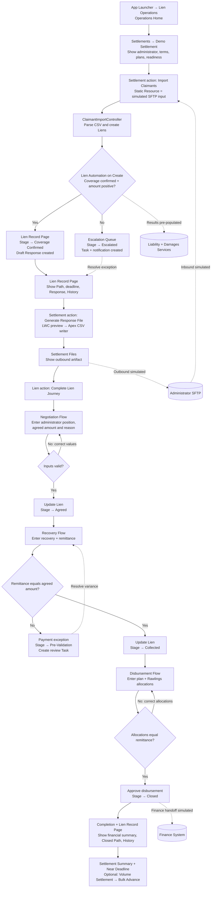
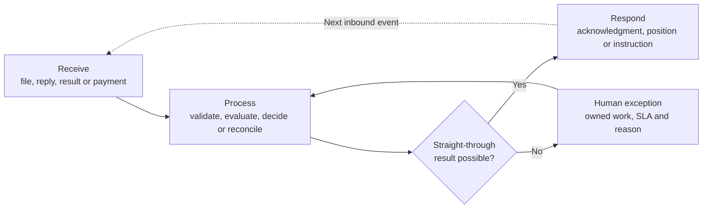

# Full Lien Lifecycle — Salesforce Screens and Functions

## Salesforce click-through lifecycle

## Presenter click sequence

| Step | Salesforce screen | Select or demonstrate | Function being proven |
|---:|---|---|---|
| 1 | Operations Home | Lien Operations app | Work, deadlines and exceptions |
| 2 | Settlements | Demo Settlement | Settlement system of record |
| 3 | Settlement Record Page | Details and participating plans | Program configuration |
| 4 | Settlement action bar | Import Claimants | Simulated inbound-file trigger |
| 5 | Import result | Success counts | Automated intake and routing |
| 6 | Lien related list | Coverage-confirmed claimant | Durable recovery opportunity |
| 7 | Lien Record Page | Path, evaluation and deadline | Evaluation state and program clock |
| 8 | Response and History | Draft position and changes | Assertion and audit trail |
| 9 | Escalation Queue | Optional escalated claimant | Human exception ownership |
| 10 | Settlement action bar | Generate Response File | Outbound response generation |
| 11 | Settlement Files | Generated CSV | Preserved outbound artifact |
| 12 | Lien action bar | Complete Lien Journey | Guided downstream workflow |
| 13 | Negotiation Flow | Counter-position and agreement | Controlled negotiation |
| 14 | Recovery Flow | Recovery and remittance | Payment reconciliation |
| 15 | Disbursement Flow | Allocations and approval | Disbursement control |
| 16 | Lien Record Page | Closed Path and History | Closure and traceability |
| 17 | Settlement Record Page | Summary and deadlines | Operational health |
| 18 | Volume Settlement | Optional Bulk Advance | Scale mechanism |

## Full business lifecycle reference

```mermaid
flowchart TB
    START([Settlement opportunity identified])

    subgraph CONFIG["1 — Settlement Configuration"]
        C1[Create settlement]
        C2[Associate administrator<br/>and participating health plans]
        C3[Configure program terms,<br/>deadlines and effective-dated rules]
        C4{Readiness gate met?}
        C5[Resolve missing configuration]

        C1 --> C2 --> C3 --> C4
        C4 -- No --> C5 --> C4
    end

    subgraph INTAKE["2 — Lien Intake"]
        I1[Receive claimant file<br/>from administrator]
        I2[Register inbound exchange<br/>and preserve source file]
        I3[Validate file and row<br/>against data contract]
        I4{Row valid?}
        I5{Existing claimant lien<br/>for this settlement?}
        I6[Create new lien]
        I7[Update existing lien]
        I8[Create rejection reason<br/>and error response]
        I9[Send intake acknowledgment<br/>or error file]

        I1 --> I2 --> I3 --> I4
        I4 -- No --> I8 --> I9
        I4 -- Yes --> I5
        I5 -- No --> I6
        I5 -- Yes --> I7
    end

    subgraph EVAL["3 — Claim Evaluation"]
        E1[Request or record<br/>Liability evaluation]
        E2{Coverage confirmed?}
        E3[Request or record<br/>Damages evaluation]
        E4[Create recoverable<br/>charge-item position]
        E5{Result complete<br/>and conclusive?}
        E6[Route to owned exception<br/>with reason and SLA]
        E7[Human researches<br/>and resolves issue]
        E8{Resolution}
        E9[Close lien — no recovery]
        E10[Create initial position<br/>before response deadline]

        E1 --> E2
        E2 -- Yes --> E3 --> E4 --> E5
        E2 -- No or uncertain --> E6
        E5 -- No --> E6
        E6 --> E7 --> E8
        E8 -- Coverage or data confirmed --> E1
        E8 -- Lien does not apply --> E9
        E5 -- Yes --> E10
    end

    subgraph RESPONSE["4 — Settlement Response and Negotiation"]
        R1[Approve initial position]
        R2[Generate and send response<br/>to administrator]
        R3[Receive administrator reply<br/>or counter-position]
        R4{Administrator accepts?}
        R5[Review disputed<br/>charge items]
        R6[Retain or remove charges<br/>with authority and reason]
        R7[Send revised position]
        R8{Agreement reached?}
        R9[Record agreed amount<br/>and charge-level disposition]

        R1 --> R2 --> R3 --> R4
        R4 -- Yes --> R9
        R4 -- No --> R5 --> R6 --> R7 --> R8
        R8 -- No --> R3
        R8 -- Yes --> R9
    end

    subgraph RECOVERY["5 — Recovery Calculation"]
        RC1[Apply effective-dated<br/>program terms]
        RC2[Apply codified<br/>state legislation]
        RC3[Apply health-plan<br/>contract terms]
        RC4[Calculate reproducible<br/>recovery amount]
        RC5{Agreed and calculated<br/>amounts reconcile?}
        RC6[Route dispute to<br/>resolution queue]
        RC7[Resolve discrepancy<br/>and record rationale]
        RC8[Approve expected recovery]

        RC1 --> RC2 --> RC3 --> RC4 --> RC5
        RC5 -- No --> RC6 --> RC7 --> RC1
        RC5 -- Yes --> RC8
    end

    subgraph COLLECTION["6 — Collection and Disbursement"]
        P1[Receive remittance<br/>from administrator]
        P2[Match payment to settlement,<br/>lien and charge items]
        P3{Payment equals<br/>expected recovery?}
        P4[Route payment variance<br/>to resolution queue]
        P5[Research and resolve<br/>payment discrepancy]
        P6[Confirm charge-level<br/>reconciliation]
        P7[Calculate health-plan<br/>and Rawlings allocations]
        P8[Approve disbursement<br/>instruction]
        P9[Send instruction to Finance]
        P10{Disbursement confirmed?}
        P11[Close lien and retain<br/>complete audit history]

        P1 --> P2 --> P3
        P3 -- No --> P4 --> P5 --> P2
        P3 -- Yes --> P6 --> P7 --> P8 --> P9 --> P10
        P10 -- No --> P4
        P10 -- Yes --> P11
    end

    START --> C1
    C4 -- Yes — open for intake --> I1
    I6 --> E1
    I7 --> E1
    E10 --> R1
    R9 --> RC1
    RC8 --> P1

    P11 -. New coverage, treatment<br/>or corrected information .-> E1

    ADMIN[(Settlement Administrator)]
    SERVICES[(Liability and<br/>Damages Services)]
    FINANCE[(Finance System)]

    ADMIN -->|Claimant file| I1
    I9 -->|Acknowledgment or errors| ADMIN
    E1 <-->|Coverage request/result| SERVICES
    E3 <-->|Damages request/result| SERVICES
    R2 -->|Initial or revised position| ADMIN
    ADMIN -->|Reply or counter-position| R3
    ADMIN -->|Remittance| P1
    P9 -->|Approved instruction| FINANCE
    FINANCE -->|Confirmation| P10

    classDef configuration fill:#e8f1fb,stroke:#2e6da4,color:#163a5c
    classDef intake fill:#e8f7f1,stroke:#27845d,color:#154c38
    classDef evaluation fill:#fff4d9,stroke:#bc7a00,color:#654400
    classDef response fill:#f3eaff,stroke:#7851a9,color:#402b5c
    classDef recovery fill:#ffece5,stroke:#b65d3a,color:#62321f
    classDef collection fill:#e9f5ff,stroke:#3178a6,color:#17405c
    classDef exception fill:#ffe6e6,stroke:#b33a3a,color:#6b2020

    class C1,C2,C3,C4,C5 configuration
    class I1,I2,I3,I4,I5,I6,I7,I8,I9 intake
    class E1,E2,E3,E4,E5,E10 evaluation
    class E6,E7,E8,E9,RC6,RC7,P4,P5 exception
    class R1,R2,R3,R4,R5,R6,R7,R8,R9 response
    class RC1,RC2,RC3,RC4,RC5,RC8 recovery
    class P1,P2,P3,P6,P7,P8,P9,P10,P11 collection
```

## Salesforce stage mapping

| Lifecycle milestone | Current/proposed Salesforce stage |
|---|---|
| Claimant row accepted | Intake |
| Liability confirmed | Coverage Confirmed |
| Evaluation requires a person | Escalated |
| Initial position assembled | Response Ready |
| Position sent to administrator | Response Submitted |
| Counter-position under review | Negotiation |
| Amount accepted by both sides | Agreed |
| Recovery rules and amounts being reconciled | Pre-Validation |
| Expected recovery approved | Recovery Calculated |
| Remittance reconciled | Collected |
| Disbursement approved and confirmed | Closed |

## Pattern repeated throughout the lifecycle

